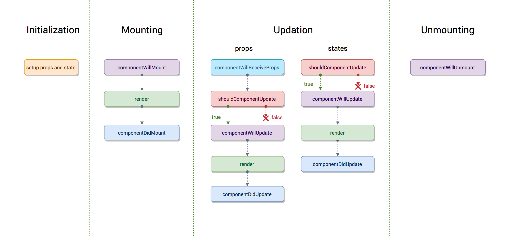

# js-concepts

### REST API 
- Make an API call and render the data 

### CSS Selectors 
- Element, class, attribute, and id selectors
- Pseudo class and element selector

```html
 selector:pseudo-class {
            property: value;
        }
```

```html
 selector::pseudo-element {
            property: value;
        }
```

### Events
- Event Bubbling
- Event Capturing 
- Event Delegation

### Promises 
- Promises chaining
- Serial Promises vs Parallel Promises

### Javascript Design Patterns 
- Publisher-subscriber 
- Singleton

### Understand Javascript this keyword in depth
- Global functions 
- IFFE functions 
- Context when using new keyword 
- Arrow functions 
- Use Strict 

### CSS Flexbox 

```html
<body>
  <div class="content">
    content
  </div>
  <footer class="footer"></footer>
</body>
```

```css
html, body {
  height: 100%;
}
body {
  display: flex;
  flex-direction: column;
}
.content {
  flex: 1 0 auto;
}
.footer {
  flex-shrink: 0;
}
```

### React
- React Component Lifecycle



- Passing Data Between React Components — Parent, Children, Siblings
- Understanding React Higher-Order Components
- Understanding React Hooks
- Getting Started with React-Redux

